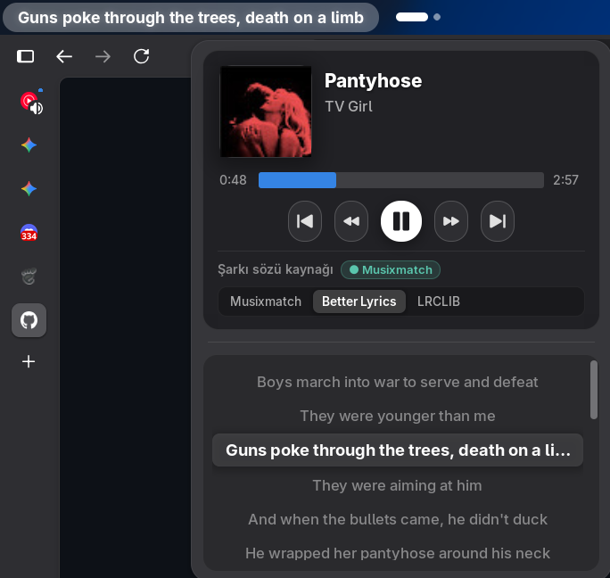
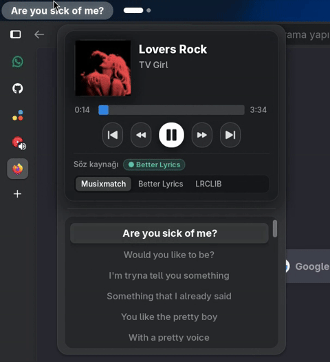

# Better Lyrics Bar

Better Lyrics Bar is a production-grade GNOME Shell extension that displays synchronized live lyrics directly in the top bar for MPRIS-compatible music players.

It is built for GNOME Shell 46–50 and supports Spotify Desktop, Spotify Web, YouTube Music Web, Apple Music Web, and other MPRIS players. Features include word-by-word synced lyrics, a multi-tier provider pipeline (**Musixmatch**, **Better Lyrics API**, and **LRCLIB**), dynamic auto-width, and an interactive song details popup menu.





## Features

- **Word-by-Word Synced Lyrics**: Real-time word-level highlighting with fluid CSS transitions and customizable text glow effects.
- **Multi-Provider Engine**: Unified pipeline integrating **Musixmatch**, **Better Lyrics API**, and **LRCLIB** with local caching and offline retrieval.
- **Dynamic Auto-Width**: The top-bar indicator smoothly resizes to fit current lyrics without awkward clipping or layout jitter.
- **Interactive Song Details Menu**: Click the top-bar lyric indicator to reveal track cover art, artist/album metadata, playback controls (Play/Pause, Next, Previous), seek bar, volume control, and active lyrics source switcher.
- **Broad MPRIS Player Support**: Native integration with Spotify Desktop, Spotify Web, YouTube Music Web, Apple Music Web, and generic MPRIS players.
- **Deep Customization**: Preferences for typography styling (system default, presets, custom HEX color picker), glow strength, drop shadow, text alignment, and panel placement.
- **Defensive Shell Architecture**: Pure domain modules, strict resource cleanup on disable, and guarded asynchronous callbacks.

## Lyrics Providers & Sync Architecture

Better Lyrics Bar integrates three prominent lyrics services into an intelligent cascading pipeline:

### 1. Musixmatch Open Desktop API (RichSync & LRC)

- **Precision**: Syllable- and word-by-word synchronized timestamps (`RichSync`), as well as line-synced lyrics (`LRC`).
- **How it works**: Queries Musixmatch's public desktop endpoints (`apic-desktop.musixmatch.com/ws/1.1/`) via automated user-token discovery (`token.get`) and macro calls (`macro.subtitles.get`).
- **Capabilities**: Delivers the highest precision word-timing data available, enabling real-time karaoke-style lyric transitions in the GNOME panel.

### 2. Better Lyrics API

- **Precision**: Word-synced (`RichSync`/`TTML`) and line-synced lyrics.
- **How it works**: Interfaces with the community-driven Better Lyrics service (`lyrics.boidu.dev`), retrieving pre-synced rich subtitle structures for popular catalog tracks.
- **Capabilities**: High-speed, lightweight lookups with zero authentication friction.

### 3. LRCLIB

- **Precision**: Standard line-by-line synced lyrics (`LRC`) and plain text fallback.
- **How it works**: Direct integration with the free, public, keyless, and open-source lyrics database ([lrclib.net](https://lrclib.net/)).
- **Capabilities**: Massive open catalog, reliable community-curated timestamps, and resilient fallback when rich word timestamps are not present.

### Multi-Tier Fallback Cascade

By default (`lyrics-source: 'musixmatch'`), Better Lyrics Bar queries providers in priority order:

1. **Musixmatch** is queried first for high-precision word-by-word `RichSync` timestamps.
2. If Musixmatch has no result or encounters an error, the **Better Lyrics API** is checked.
3. If neither returns synced lyrics, **LRCLIB** is queried as the final fallback for line-synced or plain text.
4. When synced lyrics are unavailable across all sources, the extension falls back according to user preferences (`track`, `idle`, or `hidden`).

Users can easily lock their preferred provider on-the-fly using the top-bar popup menu or through **Preferences → Lyrics source** (`musixmatch`, `better-lyrics`, or `lrclib`).

## Compatibility

| Target               | Status        |
| -------------------- | ------------- |
| GNOME Shell 46–50    | Supported     |
| Ubuntu 24.04         | Supported     |
| Fedora GNOME         | Supported     |
| Spotify Desktop      | Supported     |
| Spotify Web          | Supported     |
| YouTube Music Web    | Supported     |
| Apple Music Web      | Supported     |
| Other MPRIS players  | Best effort   |
| Non-GNOME desktops   | Not supported |
| Browser/website APIs | Not used      |

Browser player support is powered by the browser's native MPRIS integration. Better Lyrics Bar does not scrape tabs, read DOM content, or access private player credentials.

## Install

Recommended install (includes automatic daily updates):

```bash
curl -fsSL https://raw.githubusercontent.com/furkansa50/bettergnome-lyrics/main/scripts/install.sh | bash -s -- --install-updater
```

Install without auto-update:

```bash
curl -fsSL https://raw.githubusercontent.com/furkansa50/bettergnome-lyrics/main/scripts/install.sh | bash
```

Open preferences:

```bash
gnome-extensions prefs betterlyricsbar@furkansa50
```

Manual update command:

```bash
~/.local/bin/lyricbar-update
```

Uninstall:

```bash
gnome-extensions disable betterlyricsbar@furkansa50
rm -rf ~/.local/share/gnome-shell/extensions/betterlyricsbar@furkansa50
curl -fsSL https://raw.githubusercontent.com/furkansa50/bettergnome-lyrics/main/scripts/install.sh | bash -s -- --uninstall-updater
```

## Development

Requirements:

- GNOME Shell 46–50
- Node.js 22+
- `glib-compile-schemas`
- `zip`

Build and install locally:

```bash
npm ci
npm run verify
gnome-extensions install --force dist/betterlyricsbar@furkansa50.zip
gnome-extensions enable betterlyricsbar@furkansa50
```

Or install unpacked for local development:

```bash
npm run install:local
```

The generated release bundle is written to `dist/betterlyricsbar@furkansa50.zip`.

## Privacy

Better Lyrics Bar does not use telemetry and does not require account credentials. For lyric lookups, track metadata (artist, title, album, duration) is queried against the configured public lyrics services (Musixmatch, Better Lyrics, LRCLIB). No personal browsing history or account identifiers are ever transmitted. See [Privacy](docs/privacy.md).

## Troubleshooting

If the panel is blank, lyrics do not sync, or the wrong player is selected, see [Troubleshooting](docs/operations/troubleshooting.md).

## Documentation

- [Product overview](docs/product.md)
- [Engineering proposal](docs/engineering/proposal.md)
- [Player support](docs/players/README.md)
- [Player profile architecture](docs/players/profile-architecture.md)
- [Agent harness](docs/harness/agent-harness.md)
- [Runtime evidence workflow](docs/harness/runtime-evidence.md)
- [Release checklist](docs/operations/release-checklist.md)

## Acknowledgements

Better Lyrics Bar builds upon and integrates with the work of several fantastic open-source projects and services:

- **[Musixmatch](https://www.musixmatch.com/)**: For the extensive catalog of rich synchronized lyrics and subtitles.
- **[Better Lyrics](https://github.com/boidu/better-lyrics)**: For the community-driven synced lyrics API and rich sync tooling.
- **[LRCLIB](https://lrclib.net/)**: By [Tran Duc Bach](https://github.com/tranxuanbach), providing an incredible open, keyless, community-maintained synced lyrics platform.
- **[fikrilal/gnome-lyricbar](https://github.com/fikrilal/gnome-lyricbar)**: By Ahmad Fikril, serving as the original base fork for the GNOME top bar integration.

## License

MIT
